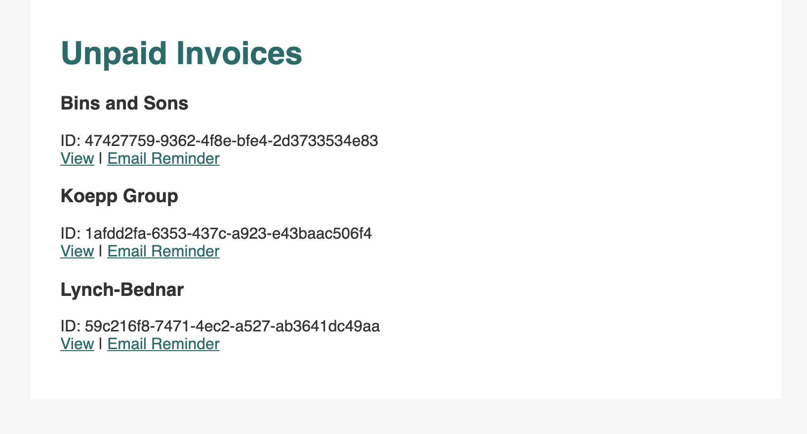
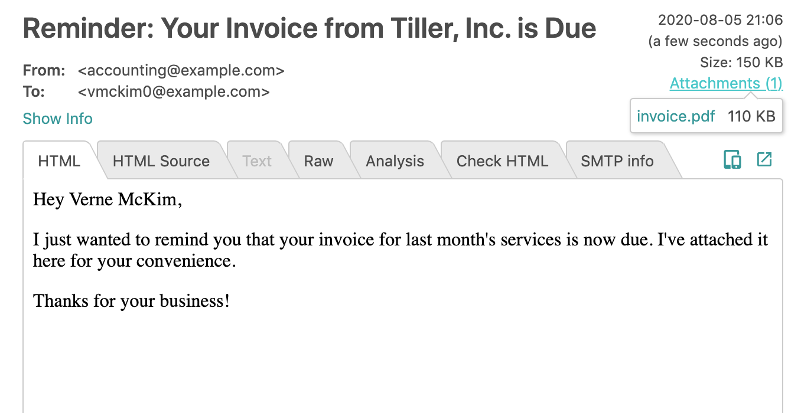

# Sending PDF Invoices in Email with Foxit

This Node application demonstrates using the Foxit HTMLtoPDF tool to generate invoices
and email them to your clients.

## Prerequisites
- Foxit SDK access and HTML2PDF compiled on your machine
- NPM and Node (version 8+)
- Mailtrap account (for testing emails)

## Setup
- Clone this repository
- Install dependencies: `npm i`
- Update the `htmlToPdfPath` variable in the `routes/invoices.js` file with the path to your Foxit HTMLtoPDF executable.
- Run the local server: `npm start`
- Visit [localhost:3000/invoices](http://localhost:3000/invoices) and click "Email Reminder" to try it out

### Web application

### Email Preview in Mailtrap

